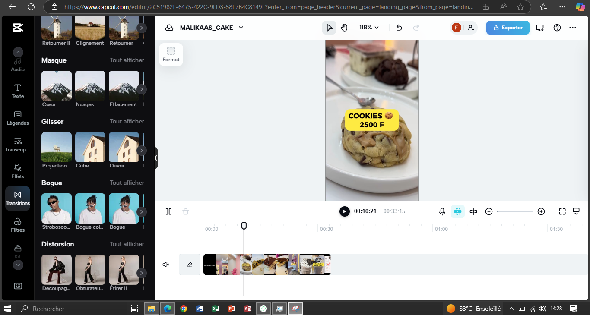
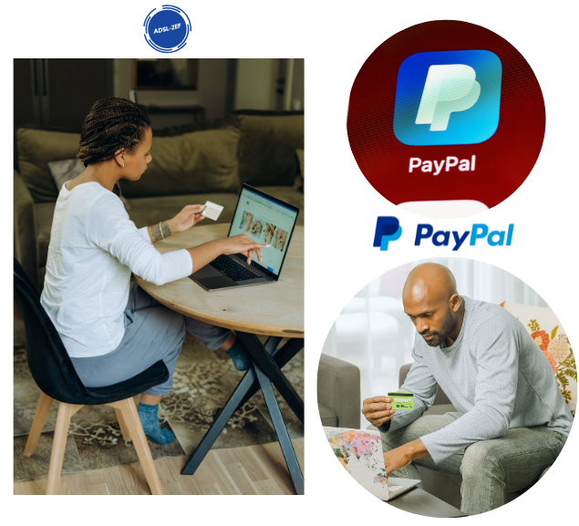
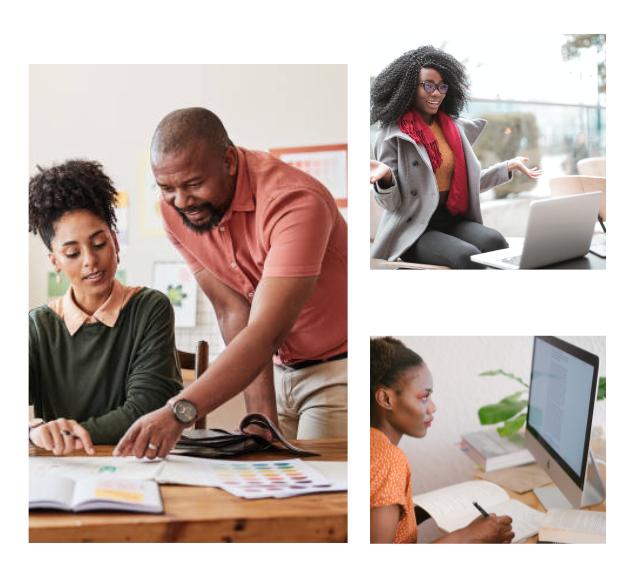
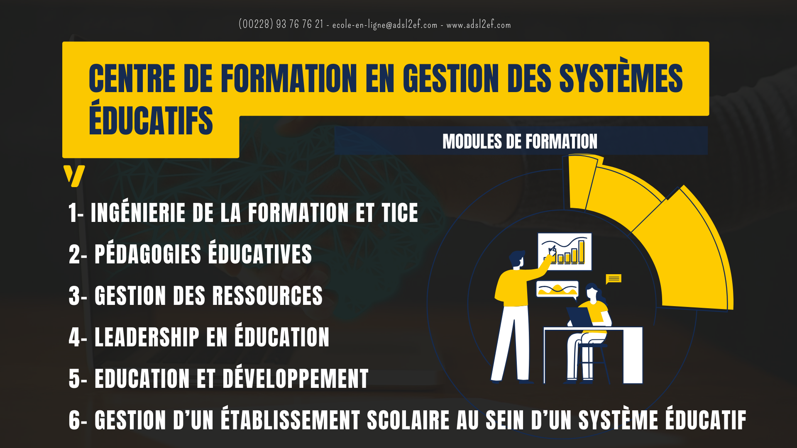

##### *QUELQUES-UNS DE MES STYLES DE CONCEPTION VISUELLE POUR DES PUBLICATIONS ADAPTEES AUX CANAUX DE DIFFUSION NUMERIQUES (SITE WEB, RESEAUX SOCIAUX) ET IMPRIMES (AFFICHES, BROCHURES, FLYERS). LISTE NON EXHAUSTIVE*    

##### [Prestation de service chez Malikaas_Cake (Janvier 2025)]
Infographie Audiovisuelle et Vidéographie

*Création de contenus vidéos promotionnelles de moins d'une minute, optimisées pour les shorts et les réseaux sociaux.*  

**Outils utilisés :**  

- **iPhone X**
- **Stabilisateur gimbal portatif**
- **CapCut** 

Démarche de conception :
- Prise de vue professionnelle,
- Éléments graphiques animés : Ajout de textes et d'animations,
- Effets visuels : Intégration d'effets dynamiques et transitions,
- Montage post-production : Suppressions de scènes, ajout de textes, d’effets, montage audio et optimisation pour les shorts et réseaux sociaux.  

  

  - [Montage vidéo pour les Menus & Prix](https://www.capcut.com/s/CUMdfxt-CQcyrCIH/)
  - [Montage vidéo pour les Menus & Prix deuxième partie](https://www.capcut.com/s/CUbSogahP-wowfwJ/)
  - [Montage vidéo pour l'expérience client](https://www.capcut.com/s/CVFhIoS5YbyItv87/)
  - [Montage vidéo pour la valorisation du cadre](https://www.capcut.com/s/CU9yq-oxjfeVULcj/)

##### [Nunya Lab (Septembre - Décembre 2024)]
*Support de publication marketing  pour la simulation individuelle d'une Campagne Emailing avec Brevo (ex Sendinblue) dans le cadre du stage*  
 - [Lien de consultaion public](https://www.canva.com/design/DAGQcKKcf0Y/erWeyED-XTXO0e39XrDTuw/view?mode=prototype)
   

  
  

##### [Responsable TICE adsl2ef (Août 2021 – Mai 2024)]

*Montage vidéo_recrutement enseignants*  

**Outil utilisé :** Canva    

- [Lien de consultaion](https://www.canva.com/design/DAEuH9BQEts/XlOOUC5BAMIhiF5-P6T-2g/edit?utm_content=DAEuH9BQEts&utm_campaign=designshare&utm_medium=link2&utm_source=sharebutton)

*Bannière de publication - promotion coaching scolaire & app mobile*

- [Lien de consultaion public](https://www.canva.com/design/DAE9Ak8was8/VUPyT4gcT0UvbBEC49oMhw/edit?utm_content=DAE9Ak8was8&utm_campaign=designshare&utm_medium=link2&utm_source=sharebutton)

  
  
  
  

  

*Cartes d'images - pour la conception web UI*

- [Lien de consultaion public](https://www.canva.com/design/DAFfWeuOsmM/nspjhFBkHuePpiiShF89Fw/edit?utm_content=DAFfWeuOsmM&utm_campaign=designshare&utm_medium=link2&utm_source=sharebutton)

  

*Bannières de publication - promotion du nouveau service & images d'illustrations des ateliers de vacances*  

  
  
  
  

  

*images de fond page accueil - pour la conception web UI*

  

*Infographie informative*

- [Lien de consultaion public](https://www.canva.com/design/DAGde3dupJM/wjGRY3PC8nvxh4e4P7mFew/edit?utm_content=DAGde3dupJM&utm_campaign=designshare&utm_medium=link2&utm_source=sharebutton)

  

*Bannières de publication - partenaire adls2ef*

  
  
  

  

*Bannières de publication évenement & promotion*

  
    

##### [CEO digitalpulse (2019 - à présent]
*Logo du site en developpement - outil canva*

##### [Freelance prestations]

*Conception - Outil photoshop*

- Groupe miraf (adls2ef partenaire)   Évenement de février 2024 pour la promotion de l'activité physique

  

  

- 2 prestation_Adjoasika Na Mawu (Boutique de mode et de création)   Mois de décembre 2024

  

    
  

  

- 1 prestation_Affiche de publication expo vente  (Lithos Bella)   Évenement d'août 2024

  

