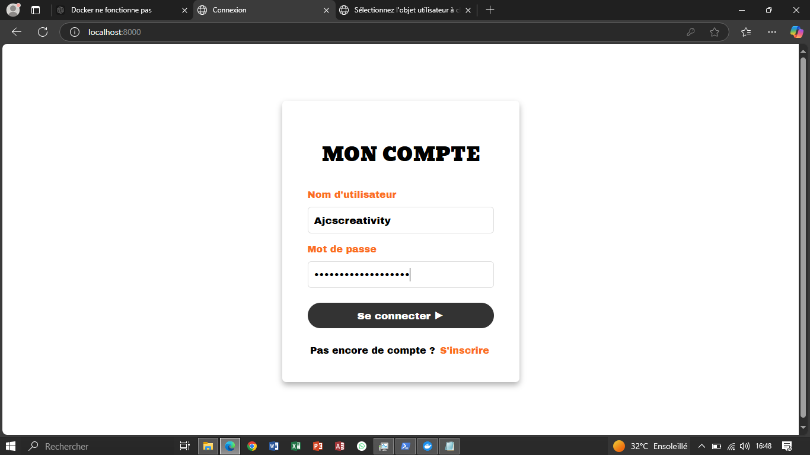
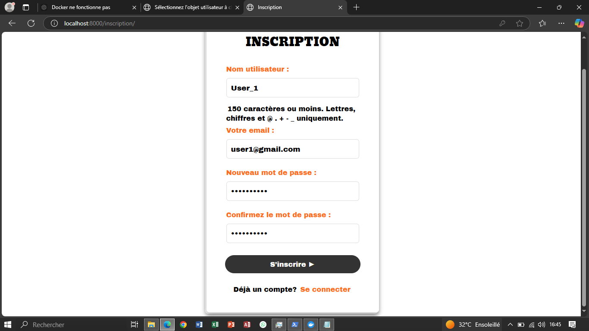
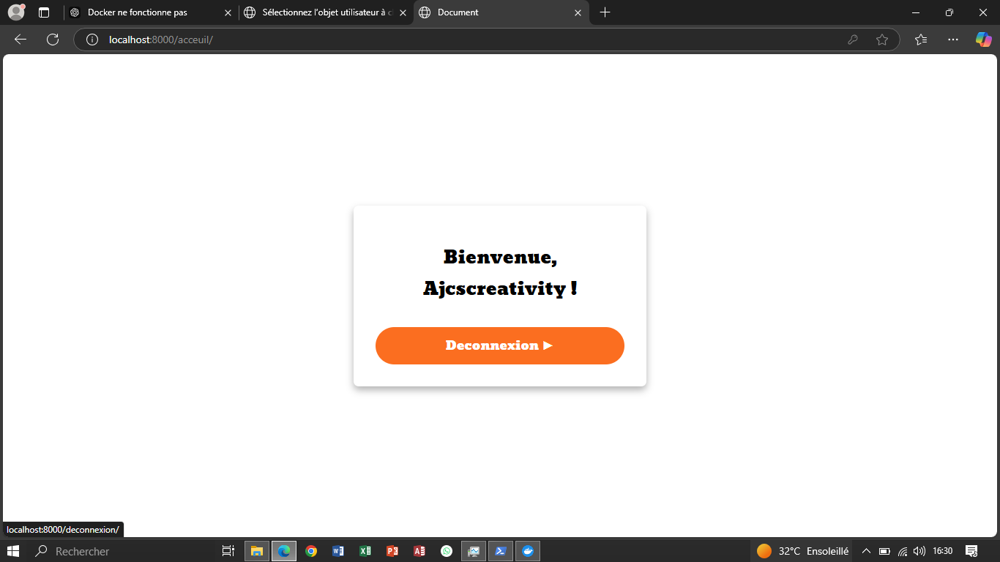

###### Mise à jours en cours...

##### Assistant en communication marketing - Ajc's Creativity (Septembre - Décembre 2024)

#### Projet de conception de site web de la société (PROJET_WEB_AJC's)
**Objectif projet** : Avoir un site web complet avec la fonctionnalité d'authentificication dans le but d'avoir et d'attirer plus d'utilisateurs grâce à un processus d'inscription et de connexion simple mais efficace.

### Mon rôle : Création de l'application d'authentification dans le projet.

- **Prototype avec Figma** :
   - Conception de la **HOMEPAGE DESKTOP** initial du site.
   - Collaborations pour affiner le design et l'expérience utilisateur.

- **Développement Django** :
   - Mise en place de l'application d'authentification, incluant la gestion des utilisateurs et la sécurisation des connexions.
   - Configuration de **MySQL** comme base de données et intégration avec **Django ORM**.

- **Dockerisation** :
   - Création d'une configuration Docker pour simplifier le déploiement et l'exécution.

## Fonctionnalités
- Authentification des utilisateurs avec Django.
- Base de données MySQL pour une gestion efficace des données.
- Orchestration avec Docker pour un environnement de développement et de déploiement cohérent.

## Captures d'écran
### Prototype Figma


### Page d'inscription


### Tableau de bord


## Installation et Exécution
1. Clonez le dépôt :
   ```bash
   git clone https://github.com/votre-utilisateur/PROJET_AJCS.git
   cd PROJET_AJCS


   Voici une version adaptée de votre documentation en suivant précisément l’ordre que vous avez demandé, tout en prenant en compte les spécificités de votre projet **PROJET_AJCS** et les informations fournies (Docker, Django, MySQL, etc.) :

---

## **Documentation du processus de mise en place de la fonctionnalités d'authentification**

### **étape 1. Installation et Configuration du Projet**

- **Mise en place de l'environnement** :
  - Utilisation de **Docker** pour simplifier le déploiement et l'exécution.
  - Technologies principales incluent : **Python 3.11**, **Django 5.1.3**, et **MySQL**.

- **Dockerisation** :
  - Configuration de l'environnement Python avec les dépendances nécessaires :
    ```dockerfile
    # Utilisation d'image officielle Python comme base
      FROM python:3.11-slim

      # Définition du répertoire de travail pour l'application
      WORKDIR /app

      # Installation des dépendances système nécessaires
      RUN apt-get update && apt-get install -y --no-install-recommends \
    gcc \
    default-libmysqlclient-dev \
    libssl-dev \
    && apt-get clean

      # Copie du fichier des dépendances (requirements.txt) dans le conteneur
      COPY requirements.txt /app/

      # Installation des packages Python dans l'environnement du conteneur
      RUN pip install --no-cache-dir -r requirements.txt

      # Copie du reste du code source
      COPY . /app/
    ```

  - Fichier `docker-compose.yml` configuration des services nécessaires :
    ```yaml
    
      version: '3.8'

      services:
     web:
    build: .
    command: python manage.py runserver 0.0.0.0:8000
    volumes:
      - .:/app
    ports:
      - "8000:8000"
    depends_on:
      - db
    environment:
      - MYSQL_HOST=db
      - MYSQL_PORT=3306
      - MYSQL_USER=user
      - MYSQL_PASSWORD=password
      - MYSQL_DATABASE=mydatabase

     db:
    image: mysql:latest
    environment:
      MYSQL_ROOT_PASSWORD: rootpassword
      MYSQL_DATABASE: mydatabase
      MYSQL_USER: user
      MYSQL_PASSWORD: password
    ports:
      - "3306:3306"
    volumes:
      - mysql_data:/var/lib/mysql

      volumes:
     mysql_data:
    ```

- **Installation des dépendances** :
  - Les dépendances sont définies dans `requirements.txt` :
    ```text
    Django==5.1.3
      mysqlclient==2.1.1  
      Pillow
      django-allauth
    ```

  - Construction et démarrage des services Docker :
    ```bash
    docker-compose up --build
    ```

---

### **étape 2. Configuration de MySQL et Intégration avec Django ORM**

1. **Configuration de la base de données** :
   - Dans , configuration d'une connexion MySQL le `site_web_ajcscreativity/settings.py`:
     ```python
     DATABASES = {
         'default': {
             'ENGINE': 'django.db.backends.mysql',
             'NAME': 'ajcs_database',
             'USER': 'User_1',
             'PASSWORD': 'user@2024',
             'HOST': 'db',
             'PORT': '3306',
         }
     }
     ```

2. **Pour les bibliothèques nécessaires** :
   - juste l'installation du driver MySQL avec :
     ```bash
     pip install mysqlclient
     ```

---

### **étape 3. Création de la Base de Données**

- La base de données est automatiquement configurée via Docker.

---

### **étape 4. Génération Automatique des Tables à Partir du Modèle**

1. Créeation de l’application `app_auth` :
   ```bash
   python manage.py startapp app_auth
   ```

2. Ajout de `app_auth` dans `INSTALLED_APPS` du fichier `settings.py` :
   ```python
   INSTALLED_APPS = [
       ...,
       'app_auth',
   ]
   ```

3. Exécution des commandes suivantes pour générer et appliquer les migrations dans le conteneur :
   ```bash
   docker-compose exec web python manage.py makemigrations
   docker-compose exec web python manage.py migrate
   ```

---

### **étape 5. Mise en Place de l'Application d'Authentification**

1. **Personnalisation du modèle utilisateur** :
   - Dans `app_auth/models.py` :
     ```python
     from django.contrib.auth.models import AbstractUser

     class CustomUser(AbstractUser):
         pass
     ```

2. Configurez Django pour utiliser le modèle personnalisé :
   ```python
   AUTH_USER_MODEL = 'app_auth.CustomUser'
   ```

3. Ajout des formulaires pour l'inscription et la connexion dans `app_auth/forms.py` :
   ```python
   from django.contrib.auth.forms import UserCreationForm, AuthenticationForm
     ```

---

### **étape 6. Mise en Place du Système d'Inscription**

1. **Vue d’inscription** :
   - Dans `app_auth/views.py` :
     ```python
     from django.shortcuts import render, redirect
     from django.contrib.auth.forms import UserCreationForm 
     from .form import CustomUserCreationForm
     from django.contrib.auth import login, authenticate, logout
     from django.contrib import messages
     from django.contrib.auth.decorators import login_required

      # Creation des views.
      def inscription(request):
       if request.method == 'POST':
        form = CustomUserCreationForm(request.POST)
        if form.is_valid():
            form.save()
            return redirect('connexion')
       else:
        form = CustomUserCreationForm()
       return render(request, 'inscription.html', {'form': form})

      def connexion(request):
       if request.method == 'POST':
        username = request.POST['username']
        password = request.POST['password']
        user = authenticate(request, username=username, password=password)
        if user is not None:
            login(request, user)
            return redirect('acceuil')
        else:
            messages.error(request, 'Nom d\'utilisateur ou mot de passe incorrect.')
       return render(request, 'connexion.html')

      @login_required
        def acceuil(request):
       return render(request, 'acceuil.html')

      def deconnexion(request):
       logout(request)
       return redirect('connexion')
     ```

2. **Template associé** :
   - Créeation du fichier `inscription.html` pour afficher le formulaire d’inscription.

   

---

### **étape 7. Mise en Place du Système de Connexion**

1. **Vue de connexion** :
   - Ajout du `login_view` dans `app_auth/views.py`.

2. **Template associé** :
   - Créeation du fichier `connexion.html` pour le formulaire de connexion.

   

---

### **étape 8. Gestion du Système de Déconnexion**

- Ajout d'une vue `logout_view` pour gérer la déconnexion.

   

---

### **étape 9. Configuration de la Page d'Accueil**

1. **Vue d’accueil** :
   - Dans `site_web_ajcscreativity/views.py` :
     ```python
     from django.shortcuts import render

     def home(request):
         return render(request, 'home.html')
     ```

2. Configuration de l’URL pour la page d’accueil :
   ```python
   urlpatterns = [
       path('', home, name='home'),
   ]
   ```

---

### **étape 10. Phase de sécurité et de Tests**

1. **Mesures de sécurité** :
   - Activation du hashage des mots de passe.
   - Protection CSRF dans les templates avec le (``).

2. **Tests** :
   - Ajout des tests dans `app_auth/tests.py` :
     ```python
     from django.test import TestCase
     from django.contrib.auth import get_user_model

     class AuthTestCase(TestCase):
         def test_inscription(self):
             User = get_user_model()
             user_count = User.objects.count()
             response = self.client.post('/auth/inscription/', {
                 'username': 'testuser',
                 'password1': 'password123',
                 'password2': 'password123',
             })
             self.assertEqual(User.objects.count(), user_count + 1)
     ```
