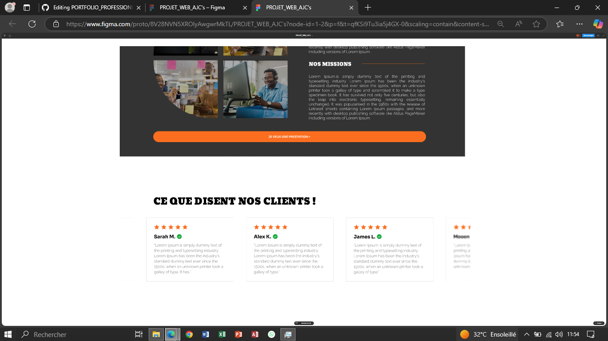
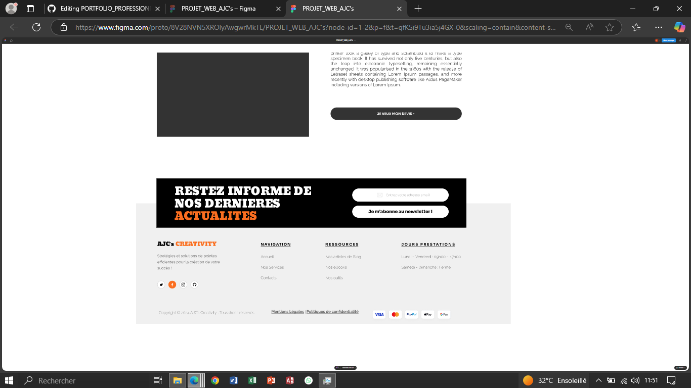

###### Mise à jours en cours...

##### Assistant en communication marketing - Ajc's Creativity (Septembre - Décembre 2024)

#### Projet de conception de site web de la société (PROJET_WEB_AJC's)
**Objectif projet** : Avoir un site web complet avec la fonctionnalité d'authentificication dans le but d'avoir et d'attirer plus d'utilisateurs grâce à un processus d'inscription et de connexion simple mais efficace.

### Mon rôle : Création de l'application d'authentification dans le projet.

- **Prototype avec Figma** :
   - Conception de la **HOMEPAGE DESKTOP** initial du site.
   - Collaborations pour affiner le design et l'expérience utilisateur.


<div style="display: flex; gap: 10px;">
  
  
</div>

🔗 [Lien prototype](https://www.figma.com/design/8V28NVN5XROlyAwgwrMkTL/PROJET_WEB_AJC's?node-id=0-1&t=is0v3rsKy7zlb0Ff-1) | [Lien view prototype](https://www.figma.com/proto/8V28NVN5XROlyAwgwrMkTL/PROJET_WEB_AJC's?node-id=0-1&t=is0v3rsKy7zlb0Ff-1).

- **Développement Django** :
   - Mise en place de l'application d'authentification, incluant la gestion des utilisateurs et la sécurisation des connexions.
   - Configuration de **MySQL** comme base de données et intégration avec **Django ORM**.
  
   

- **Dockerisation** :
   - Création d'une configuration Docker pour simplifier le déploiement et l'exécution.


   Voici une version adaptée de votre documentation en suivant précisément l’ordre que vous avez demandé, tout en prenant en compte les spécificités de votre projet **PROJET_AJCS** et les informations fournies (Docker, Django, MySQL, etc.) :

---

## **Documentation du processus de mise en place de la fonctionnalités d'authentification**

### **étape 1. Installation et Configuration du Projet**

- **Mise en place de l'environnement** :
  - Utilisation de **Docker** pour simplifier le déploiement et l'exécution.
  - Technologies principales incluent : **Python 3.11**, **Django 5.1.3**, et **MySQL**.

- **Dockerisation** :
  - Configuration de l'environnement Python avec les dépendances nécessaires dans le <br><br>`Dockerfile`:
       ```Dockerfile
    # Utilisation d'image officielle Python comme base
      FROM python:3.11-slim

      # Définition du répertoire de travail pour l'application
      WORKDIR /app

      # Installation des dépendances système nécessaires
      RUN apt-get update && apt-get install -y --no-install-recommends \
    gcc \
    default-libmysqlclient-dev \
    libssl-dev \
    && apt-get clean

      # Copie du fichier des dépendances (requirements.txt) dans le conteneur
      COPY requirements.txt /app/

      # Installation des packages Python dans l'environnement du conteneur
      RUN pip install --no-cache-dir -r requirements.txt

      # Copie du reste du code source
      COPY . /app/
    ```

  - Fichier `docker-compose.yml` configuration des services nécessaires :
    ```yaml
    
      version: '3.8'

      services:
     web:
    build: .
    command: python manage.py runserver 0.0.0.0:8000
    volumes:
      - .:/app
    ports:
      - "8000:8000"
    depends_on:
      - db
    environment:
      - MYSQL_HOST=db
      - MYSQL_PORT=3306
      - MYSQL_USER=user
      - MYSQL_PASSWORD=password
      - MYSQL_DATABASE=mydatabase

     db:
    image: mysql:latest
    environment:
      MYSQL_ROOT_PASSWORD: rootpassword
      MYSQL_DATABASE: mydatabase
      MYSQL_USER: user
      MYSQL_PASSWORD: password
    ports:
      - "3306:3306"
    volumes:
      - mysql_data:/var/lib/mysql

      volumes:
     mysql_data:
    ```

- **Installation des dépendances** :
  - Les dépendances sont définies dans `requirements.txt` :
    ```text
    Django==5.1.3
      mysqlclient==2.1.1  
      Pillow
      django-allauth
    ```

  - Construction et démarrage des services Docker :
    ```bash
    docker-compose up --build
    ```

---

### **étape 2. Configuration de MySQL et Intégration avec Django ORM**

1. **Configuration de la base de données** :
   - Dans , configuration d'une connexion MySQL le `site_web_ajcscreativity/settings.py`:
     ```python
     DATABASES = {
         'default': {
             'ENGINE': 'django.db.backends.mysql',
             'NAME': 'ajcs_database',
             'USER': 'User_1',
             'PASSWORD': 'user@2024',
             'HOST': 'db',
             'PORT': '3306',
         }
     }
     ```

2. **Pour les bibliothèques nécessaires** :
   - juste l'installation du driver MySQL avec :
     ```bash
     pip install mysqlclient
     ```

---

### **étape 3. Création de la Base de Données**

- La base de données est automatiquement configurée via Docker.

---

### **étape 4. Génération Automatique des Tables à Partir du Modèle**

1. Créeation de l’application `app_auth` :
   ```bash
   python manage.py startapp app_auth
   ```

2. Ajout de `app_auth` dans `INSTALLED_APPS` du fichier `settings.py` :
   ```python
   INSTALLED_APPS = [
       ...,
       'app_auth',
   ]
   ```

3. Exécution des commandes suivantes pour générer et appliquer les migrations dans le conteneur :
   ```bash
   docker-compose exec web python manage.py makemigrations
   docker-compose exec web python manage.py migrate
   ```

---

### **étape 5. Mise en Place de l'Application d'Authentification**

1. **Personnalisation du modèle utilisateur** :
   - Dans `app_auth/models.py` :
     ```python
     from django.contrib.auth.models import AbstractUser

     class CustomUser(AbstractUser):
         pass
     ```

2. Configurez Django pour utiliser le modèle personnalisé :
   ```python
   AUTH_USER_MODEL = 'app_auth.CustomUser'
   ```

3. Ajout des formulaires pour l'inscription et la connexion dans `app_auth/forms.py` :
   ```python
   from django.contrib.auth.forms import UserCreationForm, AuthenticationForm
     ```

---

### **étape 6. Mise en Place du Système d'Inscription**

1. **Vue d’inscription** :
   - Dans `app_auth/views.py` :
     ```python
     from django.shortcuts import render, redirect
     from django.contrib.auth.forms import UserCreationForm 
     from .form import CustomUserCreationForm
     from django.contrib.auth import login, authenticate, logout
     from django.contrib import messages
     from django.contrib.auth.decorators import login_required

      # Creation des views.
      def inscription(request):
       if request.method == 'POST':
        form = CustomUserCreationForm(request.POST)
        if form.is_valid():
            form.save()
            return redirect('connexion')
       else:
        form = CustomUserCreationForm()
       return render(request, 'inscription.html', {'form': form})

      def connexion(request):
       if request.method == 'POST':
        username = request.POST['username']
        password = request.POST['password']
        user = authenticate(request, username=username, password=password)
        if user is not None:
            login(request, user)
            return redirect('acceuil')
        else:
            messages.error(request, 'Nom d\'utilisateur ou mot de passe incorrect.')
       return render(request, 'connexion.html')

      @login_required
        def acceuil(request):
       return render(request, 'acceuil.html')

      def deconnexion(request):
       logout(request)
       return redirect('connexion')
     ```

2. **Template associé** :
   - Créeation du fichier `inscription.html` pour afficher le formulaire d’inscription.

   

---

### **étape 7. Mise en Place du Système de Connexion**

1. **Vue de connexion** :
   - Ajout du `login_view` dans `app_auth/views.py`.

2. **Template associé** :
   - Créeation du fichier `connexion.html` pour le formulaire de connexion.

   

---

### **étape 8. Gestion du Système de Déconnexion**

- Ajout d'une vue `logout_view` pour gérer la déconnexion.

   

---

### **étape 9. Configuration de la Page d'Accueil**

1. **Vue d’accueil** :
   - Dans `site_web_ajcscreativity/views.py` :
     ```python
     from django.shortcuts import render

     def home(request):
         return render(request, 'home.html')
     ```

2. Configuration de l’URL pour la page d’accueil :
   ```python
   urlpatterns = [
       path('', home, name='home'),
   ]
   ```

---

### **étape 10. Phase de sécurité et de Tests**

1. **Mesures de sécurité** :
   - Activation du hashage des mots de passe.
   - Protection CSRF dans les templates avec le (``).

2. **Tests** :
   - Ajout des tests dans `app_auth/tests.py` :
     ```python
     from django.test import TestCase
     from django.contrib.auth import get_user_model

     class AuthTestCase(TestCase):
         def test_inscription(self):
             User = get_user_model()
             user_count = User.objects.count()
             response = self.client.post('/auth/inscription/', {
                 'username': 'testuser',
                 'password1': 'password123',
                 'password2': 'password123',
             })
             self.assertEqual(User.objects.count(), user_count + 1)
     ```

---
---
---
---


## Fonctionnalités
- Authentification des utilisateurs avec Django.
- Base de données MySQL pour une gestion efficace des données.
- Orchestration avec Docker pour un environnement de développement et de déploiement cohérent.

## Captures d'écran
### Prototype Figma


### Page d'inscription


### Tableau de bord

